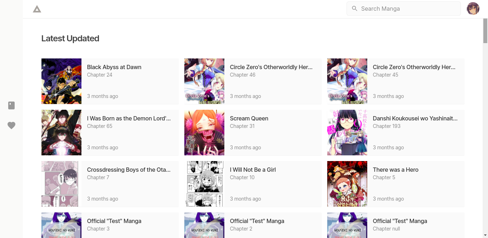
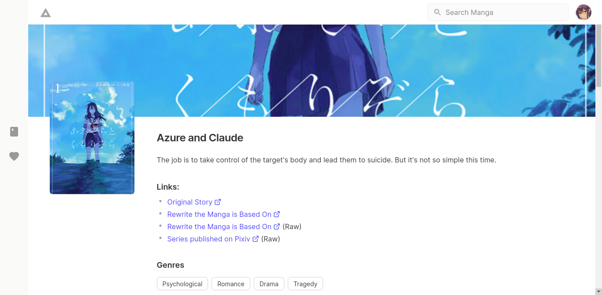
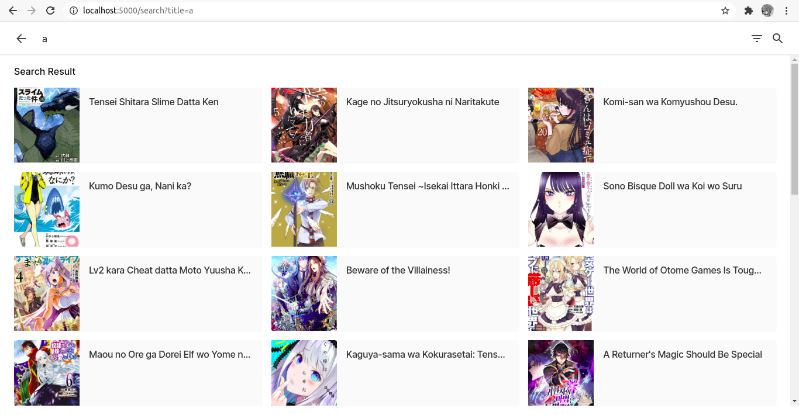
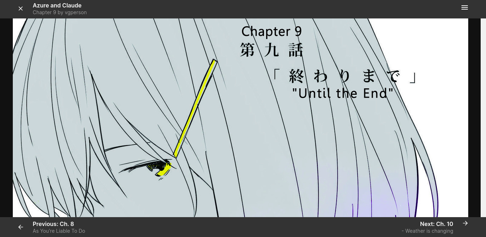
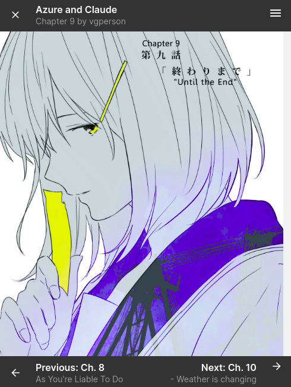

## About

Vetr is unofficial mangadex web-based manga reader.It uses MangaDex's [new V5 mangadex API](https://api.mangadex.org/docs.html)
 

## Demo Video

[Vetr Demo](https://www.youtube.com/watch?v=SWV7VHQL1nI)

## Live Demo

[Live Demo](https://vetr-app.herokuapp.com/)

## Screenshots

## Development Plan
....